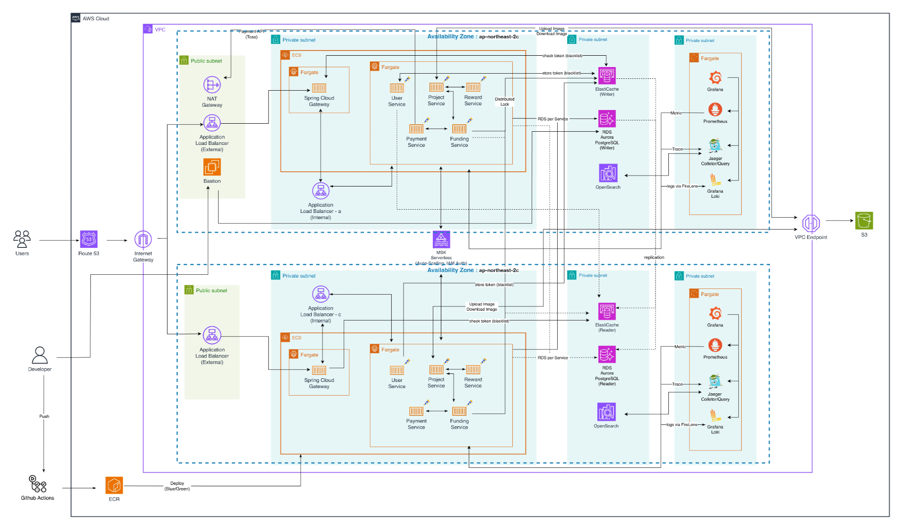
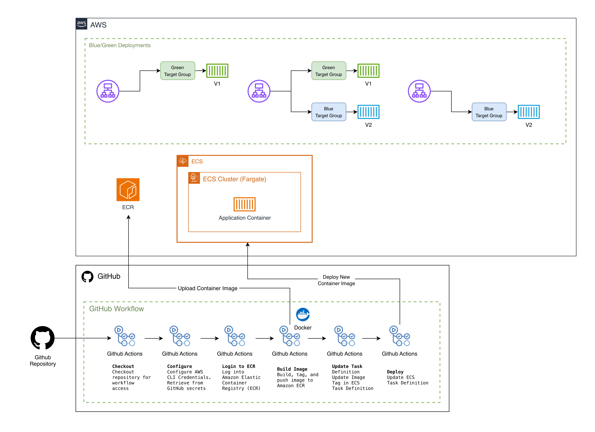
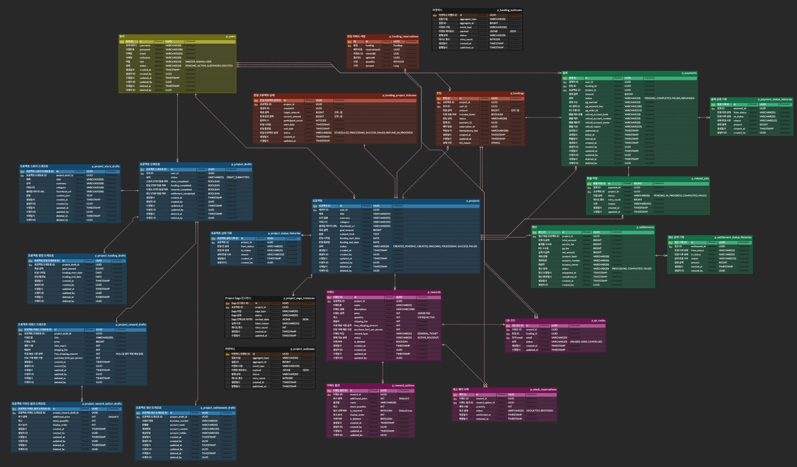
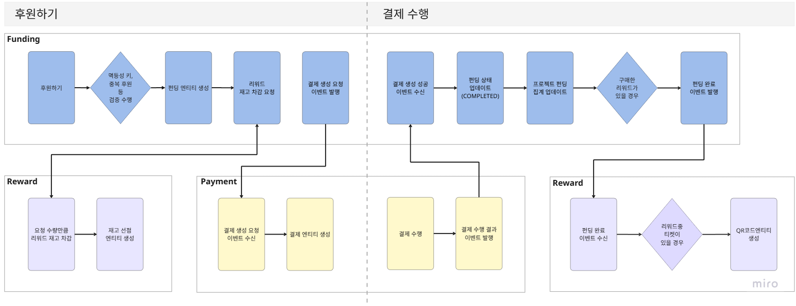
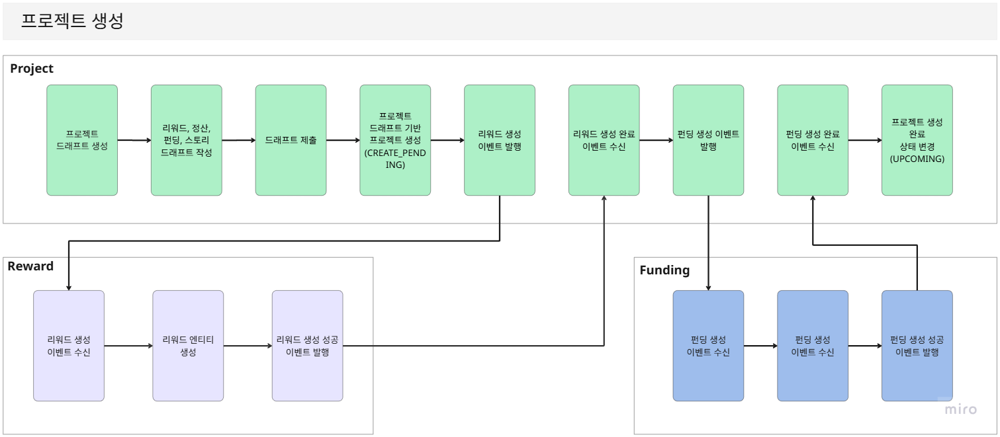
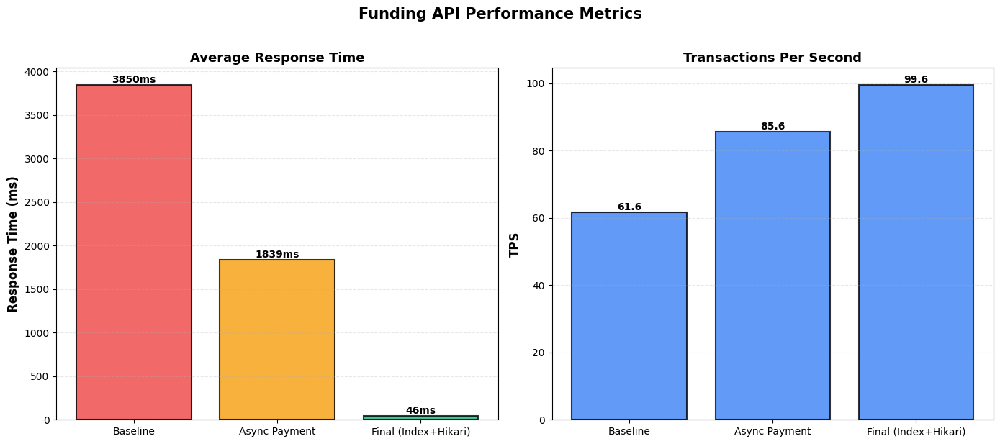
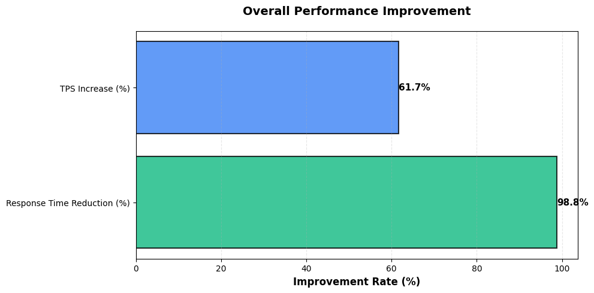
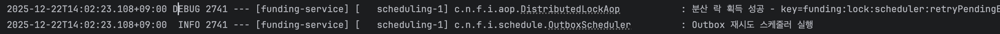
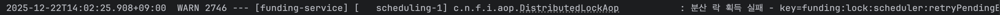

# 🎙️ Encore

> 음악가와 팬을 연결하는 크라우드펀딩 플랫폼

---

## 📚 목차

- [👥 팀원 소개](#-팀원-소개)
- [📌 프로젝트 소개](#-프로젝트-소개)
  - [개요](#개요)
  - [핵심 기능](#핵심-기능)
- [📈 Encore 비즈니스 목표](#-encore-비즈니스-목표)
- [🎯 프로젝트 목표](#-프로젝트-목표)
- [🏗️ 인프라 설계도](#-인프라-설계도)
- [🗂️ ERD](#-erd)
- [⚙️ 주요 기능](#-주요-기능)
- [🛠️ 기술 스택](#-기술-스택)
- [🧠 기술적 의사결정](#-기술적-의사결정)
- [🐞 트러블슈팅](#-트러블슈팅)

---

## 👥 팀원 소개

<div align="center">

|                                                                                         |                                                                                                                                                                                                                                               |                                                                                         |                                                                                                                                                                                                                                                     |
|:----------------------------------------------------------------------------------------------------------------------------------------------:|:------------------------------------------------------------------------------------------------------------------------------------------------------------------------------------------------------------------------------------------------------------------------------------------------------:|:---------------------------------------------------------------------------------------------------------------------------------------------:|:-----------------------------------------------------------------------------------------------------------------------------------------------------------------------------------------------------------------------------------------------------------------------------------------------------------:|
|                                                                  **김민형 (팀장)**                                                                  |                                                                                                                                              **권재원 (팀원)**                                                                                                                                              |                                                                 **오세준 (팀원)**                                                                  |                                                                                                                                                **차준호 (팀원)**                                                                                                                                                 |
|                                                유저/인증 도메인 <br/> 결제 도메인 <br/> 분산 추적 모니터링 <br/> 배포                                                |                                                                                                                        리워드 도메인 <br/> firelens & loki기반 <br/> 로그 시스템 구축 <br/> 배포                                                                                                                        |                                                               프로젝트 도메인 <br/> 배포                                                               |                                                                                                                            펀딩 도메인 <br/> 후원하기 API 성능개선 <br/> 스케쥴러 분산락 적용 <br/> 배포                                                                                                                            |
| <a href="https://github.com/rnignon"></a> | <a href="https://github.com/ReadAlien"></a><br><a href="https://willgetjob.tistory.com/"></a> | <a href="https://github.com/sejunO"></a> | <a href="https://github.com/Mybread2"></a><br><a href="https://juno0112.tistory.com/category"></a> |

</div>

---

## 📌 프로젝트 소개

> ### 개요

**Encore**는 음악가와 팬을 연결하는 크라우드펀딩 플랫폼입니다.

공연 대관료 부담으로 무대를 포기하는 청년 음악가들이 팬들의 후원을 통해 꿈의 무대를 실현할 수 있도록 돕습니다.

---

> ### 핵심 기능

### 1. All or Nothing 펀딩

- 목표 금액 달성 시에만 프로젝트 성공
- 미달성 시 전액 자동 환불로 후원자 보호

### 2. 리워드 시스템

- QR 기반 디지털 티켓으로 공연장 입장 관리
- 티켓 구매 + 추가 후원 또는 순수 후원 선택 가능
- 최소 후원 금액: 1,000원

### 3. 실시간 현황

- 목표 금액 대비 달성률 실시간 조회
- 참여자 수 및 남은 펀딩 기간 확인
- 정합성 우선의 정확한 데이터 제공

---

## 📈 Encore 비즈니스 목표

### 인디 아티스트의 무대 진입 장벽 완화
> All or Nothing 펀딩을 통해 대관료 선지불 부담을 없애고 공연 전 수요를 미리 검증해 안정적인 공연 기획을 가능하게 합니다.


### 팬과 아티스트를 잇는 정교한 리워드 경험

> QR 티켓 기반의 편리한 관람 경험을 제공하고 티켓 구매를 넘어 후원 참여로 확장되는 팬 참여 구조를 만듭니다.

### 신뢰 중심의 펀딩 생태계 구축

> 실시간 달성률과 명확한 환불 정책으로 신뢰 가능한 펀딩 환경을 제공하며 참여 데이터를 통해 아티스트에게 의미 있는 팬덤 인사이트를 전달합니다.

---

## 🎯 프로젝트 목표

> ### MSA 구조

- 프로젝트 기능을 독립 서비스 단위로 분리하여 마이크로 아키텍처 기반 설계
- 서비스 간 통신을 OpenFeign, Kafka 이벤트를 활용하여 결합도 최소화
- Saga pattern 및 Outbox Pattern의 적용으로 트랜잭션과 이벤트 정합성 확보

> ### 대규모 트래픽

- Kafka를 활용하여 이벤트를 안정적으로 처리
- 동시성 문제를 방지하는 안전한 데이터 처리 설계
- 부하 테스트(k6)를 통해 시스템 안정성 검증

> ### 빠른 장애 대응을 위한 모니터링 구축

- Prometheus, Grafana를 활용해 실시간 시스템 및 서비스 메트릭 모니터링
- Jaeger + OpenTelemetry로 서비스 간 분산 트랜잭션 추적 가능
- Loki를 통한 중앙 집중식 로그 관리 구조 구축

---

## 🏗️ 인프라 설계도
> ### 인프라 아키텍처



> ### CI / CD 아키텍처


---

## 🗃️ ERD



---

## ⚙️ 주요 기능

> ### 후원하기 (결제 · 리워드 처리)

- 재고 차감은 동기 처리로 즉시 정합성 보장
- 펀딩 / 결제 / 리워드 도메인 간 강결합 제거
- 이벤트 기반 처리로 높은 트래픽에도 안정적인 확장성 확보
- 결제 성공·실패, 펀딩 완료 등 주요 상태 변경을 명확하게 관리

---

> ### 프로젝트 생성 및 관리

- 프로젝트 기획부터 공개(오픈)까지의 과정을 단계적으로 관리
- 드래프트 기반 단계적 프로젝트 작성
- 프로젝트 생성 이후 리워드와 펀딩을 이벤트 기반으로 처리하여 서비스간 강결합 제거
- 프로젝트 상태 전이를 명확히 관리하여 오류 가능성 감소

---

## 🛠️ 기술 스택

### 언어 및 프레임워크


### 데이터 및 이벤트


### 로그 관리 및 모니터링


### 인프라 및 배포


### 테스트


### 협업 툴


---

## 🧠 기술적 의사결정

[](https://www.notion.so/teamsparta/2d02dc3ef51480b8b631f7e0b8505632)

[](https://www.notion.so/teamsparta/2d02dc3ef5148045a5ddde107108a784)

[-4285F4?style=for-the-badge&logo=notion&logoColor=white)](https://www.notion.so/teamsparta/2d02dc3ef51480ce91edc2658d02bc9d)

[](https://www.notion.so/teamsparta/Kafka-MSK-vs-SQS-2d02dc3ef514803882cae1a3a8947e3a)

[](https://www.notion.so/teamsparta/2d02dc3ef51480f6ab49f5f7572bb5ae)

[](https://www.notion.so/teamsparta/Circuit-Breaker-2d02dc3ef51480ea8e0ec75f3ea93209)

---

## 🐞 트러블슈팅

### 1. 펀딩 도메인 후원하기 API 성능 개선

> #### **문제 상황**
- 초기 응답 시간: 3,850ms (61.6 TPS)
- 목표: 애플리케이션 코드 레벨에서의 성능 개선

> #### **해결 과정**
1. 비동기 결제 처리 적용 및 비관락 부분 별도 트랜잭션 분리
2. 데이터베이스 인덱싱 최적화
3. HikariCP 튜닝

> #### **결과**




[](https://www.notion.so/teamsparta/API-2d02dc3ef514809c8209de45e187e73a)

---

### 2. 스케줄러 분산락 적용

> #### **문제 상황**
- 다중 서버 환경에서 스케줄러 중복 실행 문제

> #### **고민의 흐름**
1. DB 레벨에서 중복을 막을 수 없을까? 
2. 스케줄러 전용 인스턴스를 분리할까?
3. 스케줄러 단위에서 분산 락을 적용하자 (최종 선택)

> #### **해결 방법**
- Redisson을 활용한 분산 락 구현
- LeaseTime 설정으로 데드락 방지

> #### @DistributedLock 어노테이션

```java 
@Target(ElementType.METHOD)
@Retention(RetentionPolicy.RUNTIME)
public @interface DistributedLock {

	String key(); // 락 키 (SpEL 지원)

	TimeUnit timeUnit() default TimeUnit.SECONDS;

	long waitTime() default 5L;

	long leaseTime() default 3L;

	/**
	 * true: REQUIRES_NEW 트랜잭션으로 실행 (API용)
	 * false: 트랜잭션 없이 실행 (스케줄러용)
	 */
	boolean useTransaction() default false;
}
```

> #### 실제 사용 (Outbox 재시도 스케쥴러 적용)
```java
@Scheduled(fixedDelay = 300000)
@DistributedLock(
	key = "'scheduler:retryPendingEvents'",
	leaseTime = 4,
	timeUnit = TimeUnit.MINUTES,
	useTransaction = false
)
public void retryPendingEvents() {
	// ...
}
```

> #### **실제 적용 로그**
1번 인스턴스에서 2025-12-22T14:02:23.108+09:00 에 락 획득 성공

2번 인스턴스에서 2025-12-22T14:02:25.908+09:00 에 락 획득 실패


[](https://www.notion.so/teamsparta/2d02dc3ef5148053a7ecebd61a0f1904)

---

### 3. Kafka 역직렬화 문제

### **문제 상황**
- 이벤트 메시지 역직렬화 실패

### **해결 방법**
- JsonSerializer/JsonDeserializer 설정 최적화
- Trusted Packages 설정

[](https://www.notion.so/teamsparta/kafka-2d02dc3ef5148055b572c5c0a65fc82e)

---